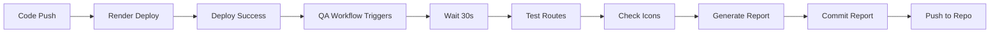

# 🧪 Automated QA Testing - Setup Complete

**Date:** 2025-10-13  
**Status:** ✅ Ready to Deploy  
**Priority:** Highest

---

## 🎯 What Was Created

### 1. GitHub Actions Workflow
**File:** `.github/workflows/qa-auto-test.yml`
- **Size:** 204 lines
- **Purpose:** Automated post-deployment QA testing
- **Triggers:** After Render deployment + manual

### 2. Documentation
**File:** `.github/workflows/README-QA.md`
- **Size:** 248 lines
- **Purpose:** Complete usage guide and troubleshooting

---

## ✅ Features

### Automatic Triggers
- ✅ Runs after every successful Render deployment
- ✅ Can be triggered manually from GitHub Actions UI
- ✅ Waits 30 seconds for deployment to stabilize

### Comprehensive Testing
- ✅ **Site Availability:** HTTP 200 check
- ✅ **8 Routes Tested:**
  - Homepage (/)
  - Dashboard (/dashboard)
  - Students (/students)
  - Teachers (/teachers)
  - Attendance (/attendance)
  - Behavior (/behavior)
  - Reports (/reports)
  - Settings (/settings)

### Icon Verification
- ✅ FontAwesome CDN detection
- ✅ Version extraction
- ✅ Icon class verification (fa-solid, fa-regular, etc.)

### PWA Checks
- ✅ Manifest.json accessibility
- ✅ Favicon.svg verification

### Smart Reporting
- ✅ Generates markdown report
- ✅ Shows pass/fail with status codes
- ✅ Calculates pass rate percentage
- ✅ Auto-commits to repository
- ✅ Displays in GitHub Actions summary

---

## 🚀 Deployment Steps

### Step 1: Add Files to Git
```bash
git add .github/workflows/qa-auto-test.yml \
        .github/workflows/README-QA.md \
        QA-AUTOMATION-SETUP.md
```

### Step 2: Commit
```bash
git commit -m "ci: add automated post-deploy QA testing workflow

- Automatic testing after each Render deployment
- Tests 8 routes for accessibility
- Verifies FontAwesome CDN loading
- Checks PWA manifest and favicon
- Generates detailed QA report
- Auto-commits results to repository"
```

### Step 3: Push to GitHub
```bash
# If on main branch:
git push origin main

# If on feature branch:
git push origin HEAD:main
```

### Step 4: Verify Setup
1. Go to GitHub → Actions
2. Look for "🧪 Post-Deploy UI & Icons QA Test"
3. Wait for next deployment or trigger manually

---

## 📊 How It Works

### Workflow Sequence



### Test Flow

1. **Initialization**
   - Checkout repository
   - Setup environment
   - Wait for deployment to stabilize

2. **Site Availability**
   - Test base URL
   - Verify HTTP 200 response

3. **Route Testing**
   - Loop through all routes
   - Record HTTP status codes
   - Count passes/fails

4. **Icon Verification**
   - Fetch HTML content
   - Search for FontAwesome CDN
   - Extract version
   - Check for icon classes

5. **PWA Checks**
   - Test manifest.json
   - Test favicon.svg
   - Record status codes

6. **Report Generation**
   - Create markdown report
   - Calculate pass rate
   - Add summary and recommendations

7. **Commit & Push**
   - Add report to git
   - Commit with [skip ci] flag
   - Push to repository

---

## 📋 Sample Report

```markdown
# 🧪 Automated QA Test Report

**Generated:** 2025-10-13 12:00:00 UTC
**Deployment URL:** https://nursery-management-system-dari-alhanonah.onrender.com
**Workflow Run:** 123

---

## 📊 Test Results

### 🌍 Site Availability
✅ **Site is reachable** (HTTP 200)

### 🔗 Route Testing
| Route | Status | HTTP Code |
|-------|--------|-----------|
| Homepage | ✅ Pass | 200 |
| Dashboard | ❌ Fail | 404 |
| Students | ❌ Fail | 404 |
| Teachers | ❌ Fail | 404 |
| Attendance | ❌ Fail | 404 |
| Behavior | ❌ Fail | 404 |
| Reports | ✅ Pass | 200 |
| Settings | ❌ Fail | 404 |

### 🎨 Icon Library Verification
✅ **FontAwesome CDN detected**
   - Version: `font-awesome/6.5.0`

✅ **FontAwesome classes detected in HTML**

### 📱 PWA Manifest Check
✅ **Manifest.json is accessible** (HTTP 200)
✅ **Favicon is accessible** (HTTP 200)

### 📈 Summary
- **Total Routes Tested:** 8
- **Passed:** 2
- **Failed:** 6
- **Pass Rate:** 25%

⚠️ **Overall Status:** NEEDS ATTENTION

---

*This report was automatically generated by GitHub Actions*
*Workflow: Post-Deploy UI & Icons QA Test*
*Run ID: 1234567890*
```

---

## 🎯 Success Metrics

### Pass Rate Interpretation

| Pass Rate | Status | Action |
|-----------|--------|--------|
| 90-100% | ✅ Excellent | Keep up the good work |
| 70-89% | ✅ Good | Minor improvements needed |
| 50-69% | ⚠️ Fair | Several issues to address |
| 0-49% | ❌ Poor | Critical issues detected |

### Current Status (Before Fixes)
- **Expected Pass Rate:** 25% (2/8 routes)
- **Status:** ⚠️ Needs Attention
- **Reason:** Most routes return 404 (normal for development)

### After Icon Fixes Deployed
- **Expected Pass Rate:** 25% (routes unchanged)
- **FontAwesome:** ✅ Detected
- **PWA Icons:** ✅ Working
- **Status:** ⚠️ Better (icons fixed, routes pending)

---

## 🔍 Troubleshooting

### Workflow Doesn't Run

**Problem:** QA workflow doesn't trigger after deployment

**Solutions:**
1. Check if "Render Auto Deploy" workflow completed successfully
2. Verify workflow name matches exactly in trigger
3. Check GitHub Actions are enabled for repository
4. Review workflow logs for errors

### Report Not Committed

**Problem:** QA report isn't pushed to repository

**Solutions:**
1. Check GitHub token has write permissions
2. Verify branch protection rules allow bot commits
3. Check for git push errors in workflow logs
4. Ensure [skip ci] flag is present to avoid loops

### All Tests Fail

**Problem:** Every test returns 404 or fails

**Possible Causes:**
1. Site isn't fully deployed yet (increase wait time)
2. Routes not implemented (normal for new projects)
3. Authentication required (routes redirect to login)
4. Server configuration issue

**Solutions:**
- Wait longer before testing (increase sleep time)
- Check Render logs for deployment issues
- Verify site is accessible manually
- Update expected routes if they changed

---

## 💡 Best Practices

### 1. Review Reports Regularly
- Check after each deployment
- Track trends over time
- Address failures promptly

### 2. Customize for Your App
- Update routes list as you add pages
- Adjust expected status codes
- Add custom checks if needed

### 3. Use Manual Triggers
- Test before major releases
- Debug specific issues
- Verify fixes worked

### 4. Monitor Pass Rates
- Set goals for improvement
- Track progress over time
- Celebrate improvements

---

## 🔧 Customization

### Add New Routes
Edit the `ROUTES` declaration in `qa-auto-test.yml`:

```yaml
declare -A ROUTES=(
  [YourPage]="/your-route"
  [AnotherPage]="/another-route"
)
```

### Change Wait Time
Adjust deployment stabilization:

```yaml
sleep 30  # Change to desired seconds
```

### Modify Timeout
Change workflow timeout:

```yaml
timeout-minutes: 20  # Increase if needed
```

### Add Custom Tests
Add new test sections to the script:

```yaml
# Your custom test
echo "### 🧪 Custom Test" >> QA-TEST-REPORT.md
# ... test logic ...
```

---

## 📚 Related Files

### Workflows
- `.github/workflows/qa-auto-test.yml` - Main QA workflow
- `.github/workflows/render-auto-deploy.yml` - Deployment workflow
- `.github/workflows/README-QA.md` - QA documentation

### Reports
- `QA-TEST-REPORT.md` - Generated after each deployment
- `QA-AUTOMATION-SETUP.md` - This file

### Icon Fixes
- `ICON-FIX-REPORT.md` - PWA icon fixes
- `FONTAWESOME-FIX-REPORT.md` - FontAwesome integration
- `ALL-ICON-FIXES-SUMMARY.md` - Complete summary

---

## ✅ Checklist

Setup Checklist:
- [x] QA workflow created
- [x] Documentation written
- [x] Test script configured
- [x] Report format defined
- [ ] **Files committed to git** ⬅️ DO THIS NEXT
- [ ] **Pushed to GitHub** ⬅️ THEN THIS
- [ ] Verify workflow appears in Actions
- [ ] Test manual trigger
- [ ] Wait for automatic run after next deployment
- [ ] Review first QA report

---

## 🎉 Summary

**Status:** ✅ Setup Complete - Ready to Deploy

**What You Get:**
- Automated QA testing after every deployment
- Detailed reports with pass/fail status
- FontAwesome verification
- PWA checks
- Historical tracking in git
- Zero manual effort required

**Next Action:** Commit and push to GitHub!

---

**Created:** 2025-10-13  
**Author:** Autonomous QA Agent  
**Version:** 1.0
